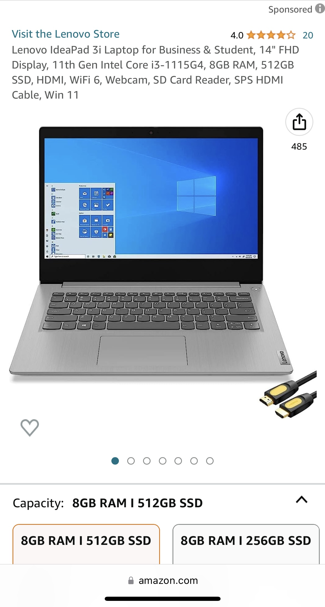
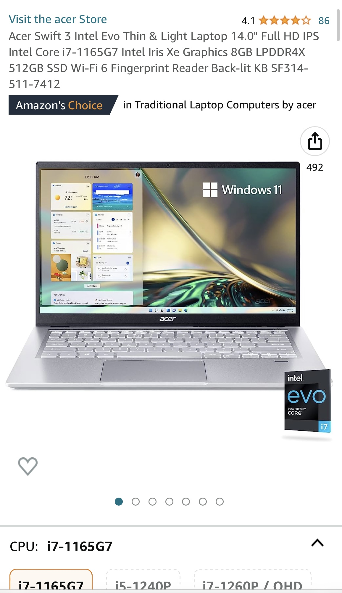
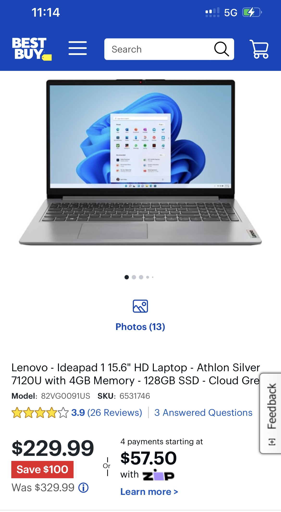

# Recommended-laptops-for-CFO

**Sierra's recommended laptops** 

## Lenovo Ideapad 3i Laptop

[title](https://www.amazon.com/Lenovo-IdeaPad-Business-Student-i3-1115G4/dp/B0BSR6N4WY/ref=sr_1_2_sspa?crid=31ZBEMBLDQUC1&keywords=lenovo%2Blaptop&qid=1689560155&refinements=p_n_feature_thirty-three_browse-bin%3A23720419011&rnid=23720416011&s=pc&sprefix=lenovo%2B%2Caps%2C196&sr=1-2-spons&sp_csd=d2lkZ2V0TmFtZT1zcF9hdGY&th=1)

*Reasons why the Lenovo Ideapad 3i Laptop is better than the CFO's Requested Laptop*

1. CPU Benchmark Score: 6158
2. System ram type: sodimm
3. Wireless communication technology: Wi-Fi

CPU model: Intel

Number of processors: 2

Amount of RAM: 8 GB

Hard Drive Storage: 512 GB

### Acer Swift Intel Evo

[title](https://www.amazon.com/gp/product/B093TMFFC3?tag=rtings-lt-r-third-party-prime-20&ie=UTF8&th=1) 

*Reasons Why the Acer Swift Intel Evo is better than the CFO's Requested Laptop*

1. CPU Benchmark Score: 10379
2. Acer Bio-Protection Fingerprint Solution
3. Up to 16 Hours Battery Life

CPU Model: 	Intel Core i7-1165G7

Number of processors: 4

Amount of RAM: 8 GB

Hard Drive Storage: 512 GB

### CFO's Requested Laptop

[title](https://www.bestbuy.com/site/lenovo-ideapad-1-15-6-hd-laptop-athlon-silver-7120u-with-4gb-memory-128gb-ssd-cloud-grey/6531746.p?skuId=6531746)

CPU model:  AMD A4-7210 APU

Number of processors: 2

Amount of RAM: 4 GB

Hard Drive Storage: 128 GB

Best overall recommended is the Acer swift Intel Evo because it has a slight better performance than the Lenovo Ideapad 3i Laptop and of course the CFO's recommended choice. 
